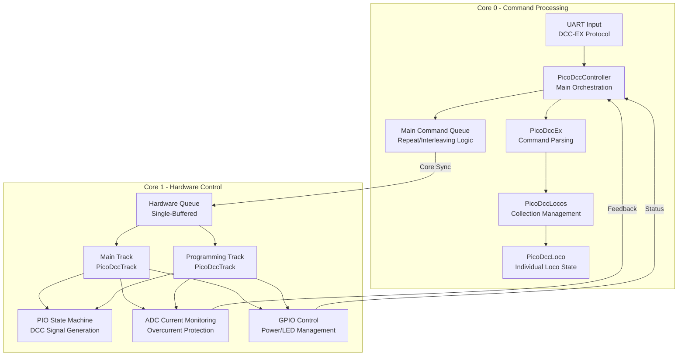

# PicoDCC Project Architecture

## Overview
This document describes the high-level architecture of the PicoDCC project, a Digital Command Control (DCC) system for model railroads built on the Raspberry Pi Pico. The system implements the DCC-EX protocol and provides comprehensive locomotive control, track management, and safety features across a dual-core architecture.

---

## Mermaid Diagram



---

## Core Responsibilities

### Core 0 - Command Processing & Logic
- **UART Communication**: Receives DCC-EX protocol commands via UART
- **Command Parsing**: `PicoDccEx` parses and validates incoming commands
- **Locomotive Management**: `PicoDccLocos` maintains collection of active locomotives
- **Command Scheduling**: Main command queue handles repeat logic for explicit commands
- **Emergency Stop**: Implements DCC broadcast emergency stop (address 0x00, instruction 0x41)
- **Timing Safety**: Monitors Core 1 health via heartbeat mechanism

### Core 1 - Hardware Control & Safety
- **Track Management**: Separate `PicoDccTrack` instances for main and programming tracks
- **DCC Signal Generation**: PIO state machines generate precise DCC waveforms
- **Current Monitoring**: ADC-based overcurrent protection and averaging (when configured)
- **Power Control**: GPIO-based track power switching with safety interlocks
- **Hardware Queue**: Single-buffered command processing for deterministic timing
- **Reminder Generation**: Main track generates locomotive reminders when hardware queue is empty

## Queue Architecture

### Main Command Queue (Core 0)
- Handles repeat logic for explicit commands (throttle, function, accessory, emergency stop)
- Allows urgent commands (emergency stop) to preempt regular traffic
- No longer handles reminder generation (moved to Core 1 for self-regulation)

### Hardware Queue (Core 1)
- **Single-buffered design**: Only one command visible at any time
- **Deterministic processing**: Guarantees consistent DCC timing
- **Priority system**: Explicit commands > locomotive reminders > idle packets
- **Self-regulating**: Reminder generation only happens when hardware has capacity
- **Debug consideration**: Use "sent" packets rather than queue state for debugging

## Component Details

### PicoDccController
- **Role**: System orchestrator and main entry point
- **Responsibilities**: 
  - Coordinates Core 0 and Core 1 operations
  - Manages main command queue (Core 0) and hardware queue synchronization
  - Implements Core 1 health monitoring via heartbeat mechanism
  - Handles emergency stop workflow (queue clearing + broadcast packet)
- **Key Methods**: `dccLoop()` (Core 1), `dccexLoop()` (Core 0)

### PicoDccEx
- **Role**: DCC-EX protocol parser and validator
- **Responsibilities**:
  - Parses incoming UART commands into structured packets
  - Validates command syntax and parameters
  - Supports throttle, function, power, and accessory commands
- **Packet Types**: Version queries, power control, locomotive commands, emergency stop

### PicoDccLoco
- **Role**: Individual locomotive state management
- **Responsibilities**:
  - Maintains speed, direction, and function states
  - Generates DCC throttle and function commands
  - **Future**: CV programming methods for decoder configuration
- **Key Features**: Address validation, speed curve conversion, function group handling

### PicoDccLocos
- **Role**: Locomotive collection management
- **Responsibilities**:
  - Maintains vector of active locomotives with semaphore protection
  - Implements reminder scheduling (accessed by Core 1 for generation)
  - Handles locomotive discovery and cleanup
  - Provides thread-safe operations for multi-core access
- **Key Features**: Round-robin reminder rotation, efficient lookup, semaphore-protected operations
- **Thread Safety**: Collection is updated by Core 0, read by Core 1 for reminders

### PicoDccTrack
- **Role**: Hardware abstraction for track control
- **Responsibilities**:
  - DCC packet generation and PIO interface
  - Power control with GPIO switching
  - Current monitoring and overcurrent protection (when ADC configured)
  - **Reminder generation**: Main track generates locomotive reminders when hardware queue empty
  - **Priority management**: Explicit commands > reminders > idle packets
- **Configuration**: Separate instances for main and programming tracks
- **Safety Features**: Automatic power cutoff on overcurrent, short circuit LED indication
- **Core 1 Operation**: Runs on Core 1, self-regulating reminder generation
- **Inter-Packet Gap**: PIO implements 232μs gap (4 half-cycles) between packets
  - Ensures decoders properly detect packet boundaries
  - Prevents FIFO-full condition from eliminating gap
  - Well within decoder DC mode timeout (10-30ms)
  - Longer preambles (20-bit prog track) revealed need for extended gap

## DCC Protocol Implementation

### Emergency Stop Behavior
- Implements **DCC-compliant broadcast** emergency stop (address 0x00, instruction 0x41)
- **Single packet approach**: One broadcast command instead of per-locomotive commands
- **Complete system reset**: Clears main queue, hardware queue, and all locomotive states
- **Immediate effect**: Preempts all other traffic for instant response

### Command Processing Flow
1. **UART Reception**: DCC-EX command received on Core 0
2. **Parsing**: `PicoDccEx` validates and structures command
3. **State Update**: Locomotive state updated in `PicoDccLocos` collection
4. **Queue Management**: Command added to main queue with repeat logic
5. **Core Synchronization**: Command transferred to Core 1 hardware queue
6. **DCC Generation**: `PicoDccTrack` builds DCC packet and sends via PIO

### Current Monitoring
- **Conditional Operation**: Only active when ADC is configured (`canReadCurrent()`)
- **Overcurrent Protection**: Automatic power cutoff at 70% of ADC range
- **Current Averaging**: Running average over configurable sample count
- **Visual Feedback**: Short circuit LED indication when available

## Error Handling & Diagnostics

### Safety Monitoring
- **Critical Conditions**: Core synchronization failures, queue overflows, overcurrent protection, timing violations
- **Diagnostic System**: Silent logging infrastructure with severity levels (CRITICAL/ERROR/WARNING/INFO)
- **Protocol Compliance**: Strict separation between DCC-EX protocol responses and internal error reporting
- **Future Integration**: Complete diagnostic framework ready for LCD display implementation

## Synchronization & Threading

### Inter-Core Communication
- **Queue-based**: Commands passed via thread-safe queue structures
- **Semaphore Protection**: `PicoDccLocos` uses semaphores for thread safety
- **Single Producer/Consumer**: Core 0 produces, Core 1 consumes commands

### Timing Considerations
- **Hardware Queue**: Single-buffered to maintain DCC timing precision
- **PIO State Machines**: Handle precise bit timing for DCC signal generation
- **Safety Monitoring**: Tracks command timing gaps for error detection

## Test Architecture

### Comprehensive Coverage
- **113 total tests** across all components: Controller (13), DCCEX (3), Locos (11), Loco (11), Packet (25), Track (21), Config Storage (11), Display (9), Diagnostic (9)
- **CMocka framework** with comprehensive mocking infrastructure
- **Hardware abstraction**: GPIO, ADC, PIO, UART, and timing mocks
- **Integration testing**: End-to-end command processing validation
- **Config validation testing**: Parameter range validation for ACK detection settings

### Mock Infrastructure
- **GPIO State Tracking**: Verifies power control and LED states
- **ADC Simulation**: Configurable current readings for overcurrent testing
- **PIO Packet Capture**: Records 64-bit DCC packets for validation
- **UART Simulation**: Command injection for protocol testing
- **Queue Mocking**: Thread-safe queue operations with observable state

### Test Categories
- **Unit Tests**: Individual component functionality
- **Integration Tests**: Cross-component interactions
- **Error Handling**: Invalid inputs and edge cases
- **Hardware Safety**: Current monitoring and power control
- **Protocol Compliance**: DCC-EX command parsing and DCC packet generation

## Hardware Configuration

### Track Settings Structure
```c
typedef struct {
    uint8_t signal_pin;    // PIO signal output pin
    uint8_t ctrl_pin;      // Power control GPIO pin
    uint8_t adc_num;       // ADC channel for current monitoring (UNUSED_PIN to disable)
    uint8_t short_pin;     // Short circuit LED pin (UNUSED_PIN to disable)
} track_settings_t;
```

### Main vs Programming Track
- **Main Track**: Uses PIO1, standard DCC preamble (14 bits)
- **Programming Track**: Uses PIO0, extended preamble (20 bits) for service mode
- **Independent Control**: Separate power, current monitoring, and command processing

### GPIO Pin Assignments
- **Power Control**: Digital output for track power switching
- **Current Monitoring**: ADC input for overcurrent protection
- **Short Circuit LED**: Visual indication of overcurrent conditions
- **Signal Output**: PIO-controlled DCC signal generation

## Development & Debugging

### Build System
- **Dual-Mode Architecture**: CMake supports both test (MSVC/mocks) and hardware (ARM GCC/Pico SDK) builds
- **Validation**: `.\scripts\Validate-DualMode.ps1` ensures cross-mode compatibility

### Debugging Strategies
- **Hardware Queue**: Check sent packets, not current queue state
- **Current Monitoring**: Verify ADC configuration before expecting protection
- **Emergency Stop**: Verify broadcast packet generation and queue clearing
- **Timing Safety**: Monitor command gaps and PIO state machine health

### Performance Considerations
- **PIO Efficiency**: Hardware-accelerated DCC signal generation
- **Queue Optimization**: Single-buffered design minimizes latency
- **Current Monitoring**: Only active when hardware is configured
- **Memory Management**: Static allocation for real-time performance

## Future Enhancements

### Planned Features
- **CV Programming**: Service mode operations for decoder configuration
- **Advanced Addressing**: Extended address support beyond current implementation
- **Function Groups**: Support for F13-F28 function ranges

### Architecture Evolution
- **Modular Tracks**: Support for multiple main tracks
- **Wireless Integration**: Bluetooth or Wi-Fi command interfaces
- **Web Interface**: Browser-based control and monitoring
- **Enhanced Logging**: Command history and performance metrics expansion
