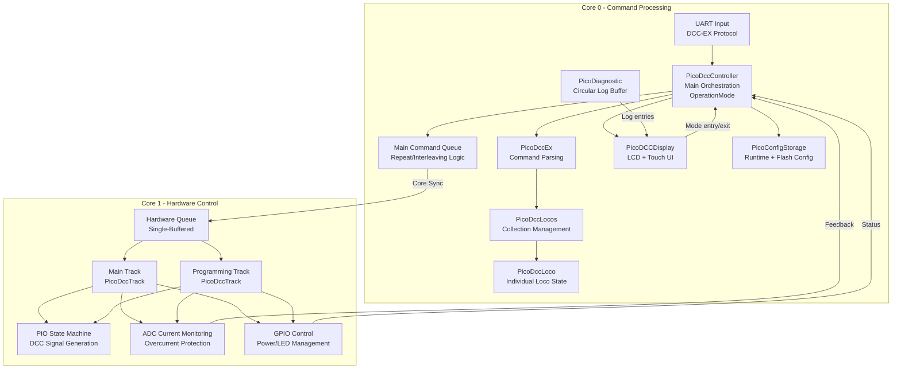

# PicoDCC Project Architecture

## Overview
This document describes the high-level architecture of the PicoDCC project, a Digital Command Control (DCC) system for model railroads built on the Raspberry Pi Pico. The system implements the DCC-EX protocol and provides comprehensive locomotive control, track management, and safety features across a dual-core architecture.

---

## Mermaid Diagram



Core 0 runs the display alongside command processing: `PicoDCCDisplay::loop()` is called
directly from `main()`'s loop, and reads controller state with a **non-blocking** semaphore
so it can never stall Core 1's DCC timing.

---

## Core Responsibilities

### Core 0 - Command Processing & Logic
- **UART Communication**: Receives DCC-EX protocol commands via UART
- **Command Parsing**: `PicoDccEx` parses and validates incoming commands
- **Locomotive Management**: `PicoDccLocos` maintains collection of active locomotives
- **Command Scheduling**: Main command queue handles repeat logic for explicit commands
- **Emergency Stop**: Implements DCC broadcast emergency stop (address 0x00, instruction 0x41)
- **Timing Safety**: Monitors Core 1 health via heartbeat mechanism. Both this and the
  command-gap check are armed on the **first loop pass**, not at construction — LCD init,
  the boot sequence and `multicore_launch_core1()` all run in between, so baselines taken
  at construction are already stale and used to fire a full emergency cutoff on every boot.
  The grace period is bounded: a Core 1 that never produces a heartbeat within
  `CORE1_STARTUP_GRACE_MS` still cuts power, so startup is not a monitoring blind spot.
- **Millisecond clock**: every timestamp in the firmware comes from `dcc_millis()`
  (`lib/dcc_time.h`), which is `to_ms_since_boot(get_absolute_time())`. The previous idiom,
  `time_us_32() / 1000`, wrapped at 4,294,967ms — 71.6 minutes — and unsigned deltas across
  that boundary yielded roughly 2^32, firing every timeout in the firmware at once (#32).
  `dcc_millis()` wraps at 49.7 days with correct deltas across the wrap. Compare
  differences, never absolute stored timestamps.

### Core 1 - Hardware Control & Safety
- **Track Management**: Separate `PicoDccTrack` instances for main and programming tracks
- **DCC Signal Generation**: PIO state machines generate precise DCC waveforms
- **Current Monitoring**: ADC-based overcurrent protection and averaging (when configured)
- **Power Control**: GPIO-based track power switching with safety interlocks
- **Hardware Queue**: Single-buffered command processing for deterministic timing
- **Reminder Generation**: Main track generates locomotive reminders when hardware queue is empty

## Queue Architecture

### Main Command Queue (Core 0)
- Handles repeat logic for explicit commands (throttle, function, accessory, emergency stop)
- Allows urgent commands (emergency stop) to preempt regular traffic
- No longer handles reminder generation (moved to Core 1 for self-regulation)

### Hardware Queue (Core 1)
- **Single-buffered design**: Only one command visible at any time
- **Deterministic processing**: Guarantees consistent DCC timing
- **Priority system**: Explicit commands > locomotive reminders > idle packets
- **Self-regulating**: Reminder generation only happens when hardware has capacity
- **Debug consideration**: Use "sent" packets rather than queue state for debugging

## Component Details

### PicoDccController
- **Role**: System orchestrator and main entry point
- **Responsibilities**: 
  - Coordinates Core 0 and Core 1 operations
  - Manages main command queue (Core 0) and hardware queue synchronization
  - Implements Core 1 health monitoring via heartbeat mechanism
  - Handles emergency stop workflow (queue clearing + broadcast packet)
- **Key Methods**: `dccLoop()` (Core 1), `dccexLoop()` (Core 0)

### PicoDccEx
- **Role**: DCC-EX protocol parser and validator
- **Responsibilities**:
  - Reads commands from raw `uart0` (initialised by `setup_default_uart()` — GPIO 0/1, 115200)
  - Parses incoming commands into structured packets and validates syntax and ranges
- **Accepted opcodes** (this is a *partial* DCC-EX implementation — treat this list, not the
  upstream DCC-EX reference, as authoritative):

  | Opcode | Form | Notes |
  |---|---|---|
  | `<0>` / `<1>` | optional `MAIN` / `PROG` | Track power off/on |
  | `<t>` | `<t cab speed dir>` | **3-field form only**; the legacy 4-field form is rejected. Cab validated **1–10239**, speed **0–126 or -1**; `-1` is a real per-loco emergency stop (`0x41 \| direction`, the same instruction byte as `<!>`) |
  | `<F>` | `<F cab func state>` | Accepted and cab-validated, but **inert** — functions are not implemented (`updateFunct()` is a stub). It no longer writes the function number into the loco's speed (#1) |
  | `<a>` | `<a addr subaddr activate>` | Accessory; address validated 1–2044 |
  | `<!>` | no parameters | Emergency stop broadcast |
  | `<s>` | no parameters | Status |
  | `<#>` | no parameters | Number of supported cabs |
  | `<D ACK LIMIT\|MIN\|MAX v>` | | Runtime ACK tuning, range-validated |
  | `<E>` | no parameters | Save config to flash; maintenance mode only |

- **Parsed but rejected**: `<S>` (sensors) is consumed by the parser but never marked valid,
  so sensor commands are not supported.

### PicoDccLoco
- **Role**: Individual locomotive state management
- **Responsibilities**:
  - Maintains speed, direction, and function states
  - Generates DCC throttle and function commands
  - **Future**: CV programming methods for decoder configuration
- **Key Features**: Address validation, speed curve conversion, function group handling

### PicoDccLocos
- **Role**: Locomotive collection management
- **Responsibilities**:
  - Maintains vector of active locomotives with semaphore protection
  - Implements reminder scheduling (accessed by Core 1 for generation)
  - Handles locomotive discovery and cleanup
  - Provides thread-safe operations for multi-core access
- **Key Features**: Round-robin reminder rotation, efficient lookup, semaphore-protected operations
- **Thread Safety**: Collection is updated by Core 0, read by Core 1 for reminders

### PicoDccTrack
- **Role**: Hardware abstraction for track control
- **Responsibilities**:
  - DCC packet generation and PIO interface
  - Power control with GPIO switching
  - Current monitoring and overcurrent protection (when ADC configured)
  - **Reminder generation**: Main track generates locomotive reminders when hardware queue empty
  - **Priority management**: Explicit commands > reminders > idle packets
- **Configuration**: Separate instances for main and programming tracks
- **Safety Features**: Automatic power cutoff on overcurrent, short circuit LED indication
- **Core 1 Operation**: Runs on Core 1, self-regulating reminder generation

### PicoDCCDisplay
- **Role**: All LCD and touch behaviour, as a self-contained component
- **Responsibilities**:
  - Owns its own timing, data gathering, screen rendering and UI state
  - Boot sequence, main status screen, diagnostic log viewer, maintenance-mode UI
  - Boot goes straight to the diagnostic screen; the colour test pattern was removed
  - The status screen shows a smoothed packets-per-second rate, and distinguishes a
    track the operator switched off from one that overcurrent tripped (`isTripped()`)
  - Reads controller and track state itself — `main()` never gathers data on its behalf
- **Hardware**: Waveshare WAV-27579, ST7789T3 controller, LVGL graphics, resistive touch
- **Structure**: `LcdDriver` and `LvglRenderer` are injected by reference, so the component
  is testable in test mode against mocks (`lib/PicoDCCDisplay/mocks/`)
- **Integration**: `main()` calls exactly three methods — `init()`, `runBootSequence()`,
  `loop(controller)`
- **Thread Safety**: Uses `sem_try_acquire()` for Core 0 reads. A blocking acquire here
  stalls Core 1 and corrupts DCC timing.

### PicoConfigStorage
- **Role**: Tunable and calibration configuration, in RAM and in flash
- **Responsibilities**:
  - Hybrid model: a **runtime** copy in RAM that commands adjust freely, and a **persistent**
    copy in the last 4KB flash sector written only on explicit save
  - CRC32 validation with fall-back to factory defaults on corruption
  - Tracks `unsaved_changes` so the UI can warn before discarding edits
- **Stored values**: ACK threshold/min/max duration, programming-track baseline current,
  ADC-to-mA conversion factor, main and programming track current limits
- **Flash safety**: a write blocks **both cores for ~410ms**, which stops DCC output. This is
  why writes are gated behind Layout Maintenance Mode — see below.
- **Flash preservation**: `memmap_picodcc.ld` shrinks the firmware FLASH region to 4092k so a
  firmware update cannot erase the config sector

### PicoDiagnostic
- **Role**: Internal diagnostic logging, strictly separate from the protocol UART
- **Responsibilities**:
  - 30-entry circular buffer (~2KB RAM) with severity levels
  - `LOG_CRITICAL` / `LOG_ERROR` / `LOG_WARNING` / `LOG_INFO` macros, tagged by component
  - Surfaced on the LCD log viewer; the main screen carries a live log-count indicator
- **Protocol rule**: `DCCEX_RESPONSE()` is reserved for genuine DCC-EX replies. A diagnostic
  emitted on that channel desynchronises JMRI.
- **Memory safety**: entries are copied byte-by-byte into a static, 8-byte-aligned buffer —
  `strncpy()` and struct assignment both hard-fault on the RP2350.

## Operation Modes

`PicoDccController` owns an `OperationMode` state machine with two states, `NORMAL` and
`LAYOUT_MAINTENANCE`. It exists for one reason: flash writes stall both cores for ~410ms,
DCC output stops, and decoders that lose the signal fall back to DC mode — which means
**full speed if the track is powered**.

### Layout Maintenance Mode

- **Entry**: LCD button only. Requiring physical presence at the controller is deliberate —
  it prevents a remote client from putting the layout into this state accidentally.
- **Entry requirement**: `canEnterMaintenanceMode()` verifies the main track is unpowered.
  The system verifies power state; the operator confirms locomotives are stopped via a modal.
  Verify-not-force: the firmware checks what it can observe and asks about what it cannot.
- **While in the mode**:
  - Main track power is locked out — `<1 MAIN>` returns `<X>`
  - The programming track continues to operate normally
  - `<D ACK ...>` adjusts runtime configuration in RAM
  - `<E>` saves configuration to flash — legal *only* in this mode
  - Throttle, function and accessory commands are silently rejected
- **Exit**: manual, from the LCD. There is no timeout. Main track power stays **off** after
  exit; the operator must re-enable it explicitly.

All four properties — LCD-only entry, verified power state, no timeout, no auto-restore —
are safety requirements rather than UX choices. Do not relax them.

## DCC Protocol Implementation

### Emergency Stop Behavior
- Implements **DCC-compliant broadcast** emergency stop (address 0x00, instruction 0x41)
- **Single packet approach**: One broadcast command instead of per-locomotive commands
- **Complete system reset**: Clears main queue, hardware queue, and all locomotive states
- **Immediate effect**: Preempts all other traffic for instant response

### Command Processing Flow
1. **UART Reception**: DCC-EX command received on Core 0
2. **Parsing**: `PicoDccEx` validates and structures command
3. **State Update**: Locomotive state updated in `PicoDccLocos` collection
4. **Queue Management**: Command added to main queue with repeat logic
5. **Core Synchronization**: Command transferred to Core 1 hardware queue
6. **DCC Generation**: `PicoDccTrack` builds DCC packet and sends via PIO

### Current Monitoring
- **Conditional Operation**: Only active when ADC is configured (`canReadCurrent()`)
  **and the track is powered** — an unpowered H-bridge is not driving the sense
  input, so a reading taken then means nothing and must not be able to trip
- **Channel selection**: the ADC mux is shared between the two tracks, so `loop()`
  calls `adc_select_input()` immediately before each `adc_read()`. Selecting once
  at construction is not enough — the other track moves the mux (#14). `adc_init()`
  resets the whole block and is therefore done once, by whichever track is
  constructed first; `adc_gpio_init()` stays per track
- **Overcurrent Protection**: automatic power cutoff above
  `TRACK_POWER_TRIP_THRESHOLD`, 90% of ADC full scale (3686 of 4096). Multiply
  before dividing — the original `RANGE / 100 * 90` truncated to 87.9% (#36)
- **Current Averaging**: mean of the last `TRACK_POWER_CURRENT_SAMPLES` (128)
  readings, about 0.9s at the ~7ms packet cadence that paces `loop()`. Reset on
  power-on and zeroed on power-off, so the LCD never shows current on a dead track
- **Visual Feedback**: Short circuit LED indication when available

## Error Handling & Diagnostics

### Safety Monitoring
- **Critical Conditions**: Core synchronization failures, queue overflows, overcurrent protection, timing violations
- **Diagnostic System**: Silent logging infrastructure with severity levels (CRITICAL/ERROR/WARNING/INFO)
- **Protocol Compliance**: Strict separation between DCC-EX protocol responses and internal error reporting
- **LCD Integration**: Logs are viewable, scrollable and clearable from the LCD log viewer,
  formatted as `[TIME] LEVEL COMPONENT: message`

## Synchronization & Threading

### Inter-Core Communication
- **Queue-based**: Commands passed via thread-safe queue structures
- **Semaphore Protection**: `PicoDccLocos` uses semaphores for thread safety
- **Single Producer/Consumer**: Core 0 produces, Core 1 consumes commands

### Timing Considerations
- **Hardware Queue**: Single-buffered to maintain DCC timing precision
- **PIO State Machines**: Handle precise bit timing for DCC signal generation
- **Safety Monitoring**: Tracks command timing gaps for error detection

## Test Architecture

### Comprehensive Coverage
- **198 total tests** across all components: Controller (24), DCCEX (3), Locos (18), Loco (20), Packet (35), Track (31), Config Storage (11), Display (9), Diagnostic (9), Wire Format (25), PIO Wire Format (13)
- **CMocka framework** with comprehensive mocking infrastructure
- **Hardware abstraction**: GPIO, ADC, PIO, UART, and timing mocks
- **Integration testing**: End-to-end command processing validation
- **Config validation testing**: Parameter range validation for ACK detection settings

### Mock Infrastructure
- **GPIO State Tracking**: Verifies power control and LED states
- **ADC Simulation**: Configurable current readings for overcurrent testing
- **PIO Packet Capture**: Records 64-bit DCC packets for validation
- **UART Simulation**: Command injection for protocol testing
- **Queue Mocking**: Thread-safe queue operations with observable state

### Test Categories
- **Unit Tests**: Individual component functionality
- **Integration Tests**: Cross-component interactions
- **Error Handling**: Invalid inputs and edge cases
- **Hardware Safety**: Current monitoring and power control
- **Protocol Compliance**: DCC-EX command parsing and DCC packet generation

## Hardware Configuration

### Track Settings Structure
```c
typedef struct {
    uint8_t signal_pin;    // PIO signal output pin
    uint8_t ctrl_pin;      // Power control GPIO pin
    uint8_t adc_num;       // ADC channel for current monitoring (UNUSED_PIN to disable)
    uint8_t short_pin;     // Short circuit LED pin (UNUSED_PIN to disable)
} track_settings_t;
```

### Main vs Programming Track
- **Main Track**: Uses PIO1, standard DCC preamble (14 bits)
- **Programming Track**: Uses PIO0, extended preamble (20 bits) for service mode
- **Independent Control**: Separate power, current monitoring, and command processing

### GPIO Pin Assignments
- **Power Control**: Digital output for track power switching
- **Current Monitoring**: ADC input for overcurrent protection
- **Short Circuit LED**: Visual indication of overcurrent conditions
- **Signal Output**: PIO-controlled DCC signal generation

## Development & Debugging

### Build System
- **Dual-Mode Architecture**: CMake supports both test (host GCC + Ninja + CMocka mocks) and
  hardware (ARM GCC / Pico SDK) builds, selected by the `TEST_BUILD` flag and exposed as the
  `host` and `pico` presets in `CMakePresets.json`. Each preset owns its own build tree
  (`build/host`, `build/pico`), so the two modes are independent: no cache clearing, and a
  build in one never invalidates the other.
- **CI**: `.github/workflows/ci.yml` runs the test build and `ctest` on every push and PR. It
  does **not** cross-compile, so hardware-mode breakage must be caught locally.
- **Validation**: `.\scripts\Validate-DualMode.ps1` covers both modes. It resolves the SDK and
  ARM toolchain from `PICO_SDK_PATH` / `PICO_TOOLCHAIN_PATH`, falling back to the newest
  install under `~/.pico-sdk`, and exits non-zero on any failure.
- **Build commands**: see `CLAUDE.md` at the repository root.

### Debugging Strategies
- **Hardware Queue**: Check sent packets, not current queue state
- **Current Monitoring**: Verify ADC configuration before expecting protection
- **Emergency Stop**: Verify broadcast packet generation and queue clearing
- **Timing Safety**: Monitor command gaps and PIO state machine health

### Performance Considerations
- **PIO Efficiency**: Hardware-accelerated DCC signal generation
- **Queue Optimization**: Single-buffered design minimizes latency
- **Current Monitoring**: Only active when hardware is configured
- **Memory Management**: Static allocation for real-time performance

## Known Gaps

Things that exist in the tree but are **not** wired into the running system. Documented here
so they are not mistaken for working features:

- **`PicoDccExConfig` is dead code.** `lib/PicoDCCEX/pico_dccex_config.cpp` implements
  `<D CONFIG ...>` and `<D CAL ...>` handlers, and the class compiles into `PicoDCCEX`, but it
  is never constructed or called. The packet validator accepts only `<D ACK ...>`, so every
  other `D` subcommand is rejected before it reaches any handler. The configuration and
  calibration command sets described in `docs/implementation-complete-config-storage.md` and
  `docs/calibration-guide.md` are therefore **not reachable on `main`**.
- **CV programming methods are declarations only.** `verifyCV()`, `readCVByte()`,
  `readCVBit()`, `writeCVBytes()` and `writeCVBit()` are declared in `pico_dccloco.h` with no
  definitions in the corresponding `.cpp`.
- **ACK detection is not implemented.** The configuration *parameters* for it exist and are
  tunable and persistable; the detection logic in `PicoDccTrack` does not.

## Future Enhancements

### Planned Features
- **CV Programming**: Service mode operations for decoder configuration. Requires ACK
  detection first — see `docs/service-mode-programming-plan.md`. Work in progress lives on
  the `programming` branch.
- **Advanced Addressing**: Extended address support beyond current implementation
- **Function Groups**: Support for F13-F28 function ranges

### Architecture Evolution
- **Modular Tracks**: Support for multiple main tracks
- **Wireless Integration**: Bluetooth or Wi-Fi command interfaces
- **Web Interface**: Browser-based control and monitoring
- **Enhanced Logging**: Command history and performance metrics expansion
