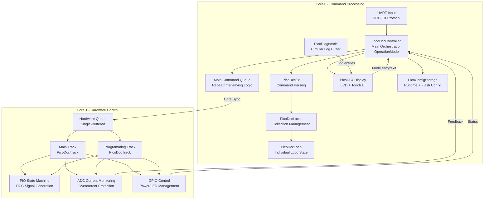

# PicoDCC Project Architecture

## Overview
This document describes the high-level architecture of the PicoDCC project, a Digital Command Control (DCC) system for model railroads built on the Raspberry Pi Pico. The system implements the DCC-EX protocol and provides comprehensive locomotive control, track management, and safety features across a dual-core architecture.

---

## Mermaid Diagram



Core 0 runs the display alongside command processing: `PicoDCCDisplay::loop()` is called
directly from `main()`'s loop, and reads controller state with a **non-blocking** semaphore
so it can never stall Core 1's DCC timing.

---

## Core Responsibilities

### Core 0 - Command Processing & Logic
- **UART Communication**: Receives DCC-EX protocol commands via UART
- **Command Parsing**: `PicoDccEx` parses and validates incoming commands
- **Locomotive Management**: `PicoDccLocos` maintains collection of active locomotives
- **Command Scheduling**: Main command queue handles repeat logic for explicit commands
- **Emergency Stop**: Implements DCC broadcast emergency stop (address 0x00, instruction 0x41)
- **Timing Safety**: Monitors Core 1 health via heartbeat mechanism. Both this and the
  command-gap check are armed on the **first loop pass**, not at construction — LCD init,
  the boot sequence and `multicore_launch_core1()` all run in between, so baselines taken
  at construction are already stale and used to fire a full emergency cutoff on every boot.
  The grace period is bounded: a Core 1 that never produces a heartbeat within
  `CORE1_STARTUP_GRACE_MS` still cuts power, so startup is not a monitoring blind spot.
- **Millisecond clock**: every timestamp in the firmware comes from `dcc_millis()`
  (`lib/dcc_time.h`), which is `to_ms_since_boot(get_absolute_time())`. The previous idiom,
  `time_us_32() / 1000`, wrapped at 4,294,967ms — 71.6 minutes — and unsigned deltas across
  that boundary yielded roughly 2^32, firing every timeout in the firmware at once (#32).
  `dcc_millis()` wraps at 49.7 days with correct deltas across the wrap. Compare
  differences, never absolute stored timestamps.

### Core 1 - Hardware Control & Safety
- **Track Management**: Separate `PicoDccTrack` instances for main and programming tracks
- **DCC Signal Generation**: PIO state machines generate precise DCC waveforms
- **Current Monitoring**: ADC-based overcurrent protection and averaging (when configured)
- **Power Control**: GPIO-based track power switching with safety interlocks
- **Hardware Queue**: Single-buffered command processing for deterministic timing
- **Reminder Generation**: Main track generates locomotive reminders when hardware queue is empty

## Queue Architecture

### Main Command Queue (Core 0)
- Handles repeat logic for explicit commands (throttle, function, accessory, emergency stop)
- Allows urgent commands (emergency stop) to preempt regular traffic
- No longer handles reminder generation (moved to Core 1 for self-regulation)

### Hardware Queue (Core 1)
- **Single-buffered design**: Only one command visible at any time
- **Deterministic processing**: Guarantees consistent DCC timing
- **Priority system**: Explicit commands > locomotive reminders > idle packets
- **Self-regulating**: Reminder generation only happens when hardware has capacity
- **Debug consideration**: Use "sent" packets rather than queue state for debugging

## Component Details

### PicoDccController
- **Role**: System orchestrator and main entry point
- **Responsibilities**: 
  - Coordinates Core 0 and Core 1 operations
  - Manages main command queue (Core 0) and hardware queue synchronization
  - Implements Core 1 health monitoring via heartbeat mechanism
  - Handles emergency stop workflow (queue clearing, repeated broadcast packet, and holding
    every known loco at speed 0 so the reminders keep asserting it)
- **Key Methods**: `dccLoop()` (Core 1), `dccexLoop()` (Core 0)

### PicoDccEx
- **Role**: DCC-EX protocol parser and validator
- **Responsibilities**:
  - Reads commands from raw `uart0` (initialised by `setup_default_uart()` — GPIO 0/1, 115200)
  - Parses incoming commands into structured packets and validates syntax and ranges
- **Accepted opcodes** (this is a *partial* DCC-EX implementation — treat this list, not the
  upstream DCC-EX reference, as authoritative):

  | Opcode | Form | Notes |
  |---|---|---|
  | `<0>` / `<1>` | optional `MAIN` / `PROG` | Track power off/on |
  | `<t>` | `<t cab speed dir>` | **3-field form only**; the legacy 4-field form is rejected. Cab validated **1–10239**, speed **0–126 or -1**; `-1` is a real per-loco emergency stop |
  | `<F>` | `<F cab func state>` | Accepted and cab-validated, but **inert** — functions are not implemented (`updateFunct()` is a stub). It no longer writes the function number into the loco's speed (#1) |
  | `<a>` | `<a addr subaddr activate>` | Accessory; address validated 1–2044. `activate` is the **gate** (coil select, bit 0), matching DCC-EX's default build. The C bit is always set and no off packet is ever sent, so a decoder that holds its coil while C is asserted is never released — the open half of #15 |
  | `<!>` | no parameters | Emergency stop broadcast |
  | `<s>` | no parameters | Status |
  | `<#>` | no parameters | Number of supported cabs |
  | `<D ACK LIMIT\|MIN\|MAX v>` | | Runtime ACK tuning, range-validated |
  | `<D SPEED28\|SPEED128>` | optional trailing `cab` | Speed step mode (#8). No cab sets the **station default**; a cab sets a **per-loco override** that a later station-wide command will not move. Replies with the resulting mode (`<D SPEED128 3>`), or `<X>` for a cab outside 1–10239 or a full loco table. RAM only, never persisted |
  | `<E>` | no parameters | Save config to flash; maintenance mode only |

- **Parsed but rejected**: `<S>` (sensors) is consumed by the parser but never marked valid,
  so sensor commands are not supported. It answers `<X>` like any other unsupported opcode.

- **Every rejected command answers `<X>`** — the DCC-EX generic rejection (#4). There are four
  rejection sites and they all reply; silence is never a valid response to a command, because a
  headless host cannot tell it apart from a dropped command or a hung station:

  | Site | Rejects |
  |---|---|
  | `PicoDccEx::processCommand` — validation | anything `validatePacket()` refuses: out-of-range throttle/function/accessory parameters, an invalid `<D>` subcommand, **and every unsupported opcode** |
  | `PicoDccEx::processCommand` — framing | a `<` with no `>` within `COMMAND_BUFFER_SIZE` (100). That `<` swallows everything after it, so this is exactly when the host needs telling |
  | `PicoDccController::dccexLoop` — mode | throttle, function and accessory commands while in `LAYOUT_MAINTENANCE`, alongside the main-track power-on lockout that already answered `<X>` |
  | `PicoDccController::dccexLoop` — capacity | a throttle command refused because the loco collection is full. It previously still sent `<l …>`, built from the *packet* rather than loco state, reporting the speed of a command that never reached the rails |

  A JMRI connect handshake now draws a short burst of `<X>` where it previously got silence, as
  its roster and route queries are unsupported. That is correct and JMRI only logs it.
  `DCCEX_RESPONSE` is a blocking `uart_puts` on Core 0, so replies are not free — acceptable
  because rejections are rare, but worth remembering before adding more of them.

- **A power cutoff is reported on the wire** (#4, second half). Every path that cuts power
  because something is *wrong* — the 100 ms timing violation, either track's PIO failure, the
  Core 1 heartbeat cutoff, and an overcurrent trip — now draws `<p0 MAIN>` and `<p0 PROG>`,
  the standard DCC-EX power notification. Before this the layout went dark and the wire stayed
  quiet, and the orchestrator went on issuing throttle commands into dead rails while
  reporting healthy.

  **The Core 1 problem this used to be blocked on is solved by splitting the latch from the
  report.** `dccLoop()` is the DCC hot path, and `DCCEX_RESPONSE` is a blocking `uart_puts` —
  a UART write there is precisely the stall the timing monitor exists to catch. So Core 1 sets
  two `volatile bool`s (`power_fault_latched`, `power_fault_unannounced`) plus the error LED,
  all single-word writes, and **Core 0 drains the announcement in `dccexLoop()`**. Nothing
  blocking is ever added to Core 1.

  It reports **once per cutoff**, not once per pass: the condition is re-evaluated every 10 ms
  and holds for as long as power is off, so an unlatched report would be 100 frames a second
  on a link JMRI also speaks. The same latch stops the `LOG_CRITICAL` calls refilling the
  30-entry diagnostic buffer in 300 ms and erasing the history that explains the fault.

  **The error LED follows the latch, not the instantaneous condition** (#42). Cutting power
  stops commands being sent, so on the very next pass the measured gap is small again and the
  PIO reads healthy — and the old `else` branch turned the LED back off, leaving both tracks
  unpowered, the LED dark, and a system that looked fine. The only surviving evidence was a
  `LOG_CRITICAL` on the LCD, which is not where anyone looks first, and it is a large part of
  why #32 was so hard to diagnose.

  **The latch clears only when power is deliberately restored**, observed as
  `main_track->getPower()` becoming true again rather than by hooking each command path — so
  the LCD's direct `setPower()` call is covered without `lvgl_renderer` knowing the latch
  exists. If the underlying fault is still there, the next pass re-trips and the host is told
  again, which is the right answer to "restore power into a station that is still faulty".
  There is deliberately **no** automatic power restore: a decoder that loses the DCC signal
  falls back to DC, and DC on a powered main track is full speed.

- **The `<l cab reg speedByte functMap>` cab update** follows the published DCC-EX format.
  `speedByte` is the DCC 128-step byte: bit 7 is direction, and the low 7 bits are
  `0` = stop, `1` = emergency stop, `2`–`127` = speed steps 1–126. A wire speed of N therefore
  maps to **N + 1**:

  | `<t>` speed | Forward | Reverse |
  |---|---|---|
  | `0` (stop) | 128 | 0 |
  | `-1` (emergency stop) | 129 | 1 |
  | `1` (slowest step) | 130 | 2 |
  | `126` (full) | 255 | 127 |

  This subtracted one rather than adding one until 2026-08-22 — an undocumented JMRI
  workaround predating any check against the published format. It reported every moving speed
  **two steps low**, and made wire speed 1 report as `129`, which in the forward direction *is*
  emergency stop. Direction is applied as a bit test rather than `direction * 128`, so a
  direction field carrying anything other than 0 or 1 cannot overflow the byte.

- **The rail-side speed byte is 128-step by default**, built in
  `PicoDccLoco::generateThrottleCommand()`. S-9.2.1 advanced operations: instruction byte
  `0x3F`, then one byte of `(direction << 7) | value`. The `<t>` wire speed maps to that
  value **N + 1**, except that 0 maps to 0 — the same off-by-one the `<l>` reply above has,
  and now the two agree:

  | `<t>` speed | Value | Byte (forward / reverse) |
  |---|---|---|
  | `0` (stop) | 0 | `0x80` / `0x00` |
  | `-1` (emergency stop) | 1 | `0x81` / `0x01` |
  | `1` (slowest step) | 2 | `0x82` / `0x02` |
  | `126` (full) | 127 | `0xFF` / `0x7F` |

  Every one of the 127 values a host can send therefore produces a distinct packet, which is
  what the orchestrator's braking model (`layout-orchestration` `docs/braking.md`) and its
  `crawl_speed_step` assume. This is a **two-byte instruction**, so a long-address throttle
  packet is four payload bytes plus the checksum — exactly filling the 64-bit PIO word to
  `DCC_PACKET_FIRST_BYTE`, with no room for a fifth. `pico_dcc_pio_tests.cpp` asserts that
  packet decodes correctly off the emulated rails.

- **28 steps is retained as a per-loco fallback**, selected by `<D SPEED28 cab>` for a decoder
  that cannot do 128. The wire's 0-126 speed is scaled to a 0-28 step, then encoded per S-9.2
  as `01DCSSSS`, where the 5-bit speed value is `(SSSS << 1) | C`:

  | Speed value | Meaning | Byte (forward / reverse) |
  |---|---|---|
  | 0 | controlled stop | `0x60` / `0x40` |
  | 1, 3 | emergency stop | - |
  | 2 | emergency stop (used for `<t cab -1 dir>`) | `0x61` / `0x41` |
  | N + 3 | moving step N of 28 | - |

  Step 0 produced value 3 -- an emergency stop -- until 2026-08-23, because the encoding
  expression was written for moving steps only. **Every ordinary stop on the layout was an
  emergency stop**, so a locomotive commanded to stop slammed to a halt instead of
  decelerating under its own momentum CV, and the final command of an orchestrator braking
  ramp was discarded (#48). The 126-to-28 scaling is coarse at the bottom — wire speeds 1-5
  all collapse to step 1 — which is why it is the fallback and not the default (#8).

- **Speed step mode lives in RAM and is never persisted.** The orchestrator owns the loco
  roster and re-asserts each loco's mode when it sees the station's boot banner, so a copy in
  flash could only ever disagree with it. A `PicoDccLoco` follows the station default until a
  `<D SPEED28|SPEED128 cab>` names it; naming it re-encodes its stored command in place, so
  Core 1's reminder stream picks the new encoding up without waiting for a throttle command.
  Naming a cab the station has never seen **creates it**, stopped and facing forward, so the
  encoding is already right when the first throttle command arrives.

### PicoDccLoco
- **Role**: Individual locomotive state management
- **Responsibilities**:
  - Maintains speed, direction, and function states
  - Generates DCC throttle and function commands
  - **Future**: CV programming methods for decoder configuration
- **Key Features**: Address validation, speed curve conversion, function group handling

### PicoDccLocos
- **Role**: Locomotive collection management
- **Responsibilities**:
  - Maintains vector of active locomotives with semaphore protection
  - Implements reminder scheduling (accessed by Core 1 for generation)
  - Handles locomotive discovery and cleanup
  - Provides thread-safe operations for multi-core access
- **Key Features**: Round-robin reminder rotation, efficient lookup, semaphore-protected operations
- **Thread Safety**: Collection is updated by Core 0, read by Core 1 for reminders

### PicoDccTrack
- **Role**: Hardware abstraction for track control
- **Responsibilities**:
  - DCC packet generation and PIO interface
  - Power control with GPIO switching
  - Current monitoring and overcurrent protection (when ADC configured)
  - **Reminder generation**: Main track generates locomotive reminders when hardware queue empty
  - **Priority management**: Explicit commands > reminders > idle packets
- **Configuration**: Separate instances for main and programming tracks
- **Safety Features**: Automatic power cutoff on overcurrent, short circuit LED indication
- **Core 1 Operation**: Runs on Core 1, self-regulating reminder generation
- **Pacing**: `PicoDccTrack::loop()` takes a `Pacing` argument. The main track is passed
  `Pacing::Blocking` and parks Core 1 in `pio_sm_put_blocking` when its TX FIFO is full --
  that block is what keeps the loop from outrunning the PIO. The programming track is passed
  `Pacing::NonBlocking`: it checks `pio_sm_get_tx_fifo_level()` for room for a whole packet
  (two words, in an 8-word joined FIFO) *before* touching any command source, and returns
  early if there is none. The check has to precede the dequeue, because `queue_try_remove()`
  and `getNextReminder()` both consume what they return.

  Both tracks blocked until 2026-08-23, which paced the loop at the programming track's
  slower rate -- `DCC_PROG_PREAMBLE 20` against `DCC_MAIN_PREAMBLE 14` -- so the main track
  refilled more slowly than it drained. Its FIFO trended empty, and at the time an empty FIFO
  parked the signal pin high (#34), so the coupling showed on a scope as 2.2-2.5ms of DC on
  the main track between packets against the programming track's designed 197-209us (#35).
  A starved FIFO now idles on `1` bits instead (see below), so the same coupling today would
  cost throughput rather than putting DC on the rails.

- **The inter-packet gap is a bit, not a held level.** `dcc.pio` emits one legal `1` bit
  between packets -- 58us high, then 58us low split across the `.wrap` so that the five
  cycles of `pull noblock` / `out y` / `out x` / `jmp x!=y` / `jmp x--` land *inside* the low
  half rather than extending it. Those five instructions carry the previous pin level,
  because side-set is `opt`. (It was four before the starvation branch below added one to
  the packet path; the gap's own delay dropped from four cycles to three to pay for it.)

  It used to be two `side 1` delays: 116us of high with no low half, running into the four
  carried cycles and then the next packet's first preamble instruction. The line was
  continuously high for **203us** and then dropped for 58us -- mismatched halves, so not a
  bit at all. A decoder resynchronised and consumed the first preamble bit, leaving exactly
  the S-9.1 minimum of 14 with nothing spare, and an H-bridge driven from the pin put 203us
  of DC on the rails at every packet boundary (#34). Measured on a scope at the GPIO on
  2026-08-23 as 197-209us, and reproduced exactly by the emulator.

- **A starved FIFO idles on `1` bits, it does not park.** `.wrap` used to target
  `pull block`, and a stalled instruction holds the pin at its last side-set value. An empty
  TX FIFO was therefore not "signal stops", it was one polarity held for as long as the FIFO
  stayed empty -- DC on the rails, and a decoder that loses the alternating waveform falls
  back to DC mode, which means full speed.

  `pull noblock` copies X into the OSR on an empty FIFO instead, and the program branches to
  a three-instruction `starved` loop that emits legal `1` bits until real data arrives. The
  starvation test costs no sentinel register: on a starved pull both `out`s read the same
  byte of X, so `X == Y`, and a real packet can never do that -- Y is the preamble count (14
  main, 20 prog) and X is the byte count, at most six. `dcc_program_init()` seeds X and Y
  equal so the first pass on an empty FIFO idles rather than transmitting whatever the
  scratch registers powered up holding.

  The cycle budget is the delicate part, because the header runs at the carried-low level and
  so counts toward the low half of the preceding bit. All four paths total eight cycles:
  gap-to-packet 3+5, gap-to-starved 3+4+1, starved-to-starved 3+4+1, starved-to-packet 3+5.
  The program is 32 of the 32 available instructions -- full, with no headroom left. Adding
  anything to `dcc.pio` now means taking something out first.

- **A header claiming zero bytes is discarded, not transmitted.** A packet is one or two
  32-bit words, and if the FIFO ever slips by one the state machine pulls a packet's *second*
  word at `start` and reads it as a header. An idle packet's second word is `0xFF000000`:
  preamble 255, byte count 0. `jmp x--` post-decremented that 0 to `0xFFFFFFFF`, so the
  packet claimed 4.29 billion bytes and never ended -- the state machine emitted every
  subsequent FIFO word verbatim as 9-bit data bytes, with no preamble, until the board was
  rebooted. Captured on the bench in `DCC_Broken.png`: the main track carried
  `... 3F 80 BB | 00 00 | 0E 04 03 3F ...`, which is the raw packet words on the rails,
  `0E` being `DCC_MAIN_PREAMBLE` and `04` being `length+1`. Every locomotive held its last
  commanded speed for as long as it lasted.

  The guard at `have_packet` costs one instruction and sends a zero-count header to
  `starved_high` instead. Dropping that word is also the resync: one word out of step,
  dropped, puts the next pull back on a real first word. It is off the packet path, so all
  four budgets above are untouched; the recovery bit itself is 9 cycles low against 8 high,
  one malformed bit at the moment of recovery.

  This bounds the damage rather than removing the cause. **What put the FIFO one word out of
  step is not known.** Word pushes match word consumption for every payload length, there is
  a single writer, nothing clears or restarts the state machine, and both queues use the same
  element size -- so the trigger is still open. A header with a *non-zero* but wrong byte
  count is still transmitted as a long garbage packet; only the permanent case is caught.
  The session it was seen in also logged a DCC timing violation, at an unrecorded point.

  This also means #35's "keep the FIFO full" is no longer load-bearing for safety -- it is
  back to being a throughput property. `dccLoop()`'s 100ms timing-violation cutoff still
  catches a Core 1 that has stopped refilling.

  **Verified by emulation, not yet on hardware.** `test_starved_fifo_emits_an_idle_carrier_not_dc`
  and `test_idle_carrier_bits_are_in_spec` assert the carrier is alternating and inside the
  S-9.1 window, and `test_packet_after_starvation_still_decodes` covers the starved-to-packet
  transition where a mis-budgeted cycle would show. The scope check at the GPIO is still owed.

### PicoDCCDisplay
- **Role**: All LCD and touch behaviour, as a self-contained component
- **Responsibilities**:
  - Owns its own timing, data gathering, screen rendering and UI state
  - Boot sequence, main status screen, diagnostic log viewer, maintenance-mode UI
  - Boot goes straight to the diagnostic screen; the colour test pattern was removed
  - The status screen shows a smoothed packets-per-second rate, and distinguishes a
    track the operator switched off from one that overcurrent tripped (`isTripped()`)
  - Reads controller and track state itself — `main()` never gathers data on its behalf
- **Hardware**: Waveshare WAV-27579, ST7789T3 controller, LVGL graphics, resistive touch
- **Structure**: `LcdDriver` and `LvglRenderer` are injected by reference, so the component
  is testable in test mode against mocks (`lib/PicoDCCDisplay/mocks/`)
- **Integration**: `main()` calls exactly three methods — `init()`, `runBootSequence()`,
  `loop(controller)`
- **Thread Safety**: Uses `sem_try_acquire()` for Core 0 reads. A blocking acquire here
  stalls Core 1 and corrupts DCC timing.

### PicoConfigStorage
- **Role**: Tunable and calibration configuration, in RAM and in flash
- **Responsibilities**:
  - Hybrid model: a **runtime** copy in RAM that commands adjust freely, and a **persistent**
    copy in the last 4KB flash sector written only on explicit save
  - CRC32 validation with fall-back to factory defaults on corruption
  - Tracks `unsaved_changes` so the UI can warn before discarding edits
- **Stored values**: ACK threshold/min/max duration, programming-track baseline current,
  ADC-to-mA conversion factor, main and programming track current limits
- **Flash safety**: a write blocks **both cores for ~410ms**, which stops DCC output. This is
  why writes are gated behind Layout Maintenance Mode — see below.
- **Flash preservation**: `memmap_picodcc.ld` shrinks the firmware FLASH region to 4092k so a
  firmware update cannot erase the config sector

### PicoDiagnostic
- **Role**: Internal diagnostic logging, strictly separate from the protocol UART
- **Responsibilities**:
  - 30-entry circular buffer (~2KB RAM) with severity levels
  - `LOG_CRITICAL` / `LOG_ERROR` / `LOG_WARNING` / `LOG_INFO` macros, tagged by component
  - Surfaced on the LCD log viewer; the main screen carries a live log-count indicator
- **Protocol rule**: `DCCEX_RESPONSE()` is reserved for genuine DCC-EX replies. A diagnostic
  emitted on that channel desynchronises JMRI.
- **Memory safety**: entries are copied byte-by-byte into a static, 8-byte-aligned buffer —
  `strncpy()` and struct assignment both hard-fault on the RP2350.

## Operation Modes

`PicoDccController` owns an `OperationMode` state machine with two states, `NORMAL` and
`LAYOUT_MAINTENANCE`. It exists for one reason: flash writes stall both cores for ~410ms,
DCC output stops, and decoders that lose the signal fall back to DC mode — which means
**full speed if the track is powered**.

### Layout Maintenance Mode

- **Entry**: LCD button only. Requiring physical presence at the controller is deliberate —
  it prevents a remote client from putting the layout into this state accidentally.
- **Entry requirement**: `canEnterMaintenanceMode()` verifies the main track is unpowered.
  The system verifies power state; the operator confirms locomotives are stopped via a modal.
  Verify-not-force: the firmware checks what it can observe and asks about what it cannot.
- **While in the mode**:
  - Main track power is locked out — `<1 MAIN>` returns `<X>`
  - The programming track continues to operate normally
  - `<D ACK ...>` adjusts runtime configuration in RAM
  - `<D SPEED28|SPEED128 [cab]>` sets the speed step mode, station-wide or per loco (#8)
  - `<E>` saves configuration to flash — legal *only* in this mode
  - Throttle, function and accessory commands are silently rejected
- **Exit**: manual, from the LCD. There is no timeout. Main track power stays **off** after
  exit; the operator must re-enable it explicitly.

All four properties — LCD-only entry, verified power state, no timeout, no auto-restore —
are safety requirements rather than UX choices. Do not relax them.

## DCC Protocol Implementation

### Emergency Stop Behavior
- Implements **DCC-compliant broadcast** emergency stop (address 0x00, instruction 0x41),
  one broadcast rather than per-locomotive commands
- **Repeated `DCC_ESTOP_BROADCAST_REPEATS` times** (5). It was sent exactly once, against 3
  for an ordinary throttle change, on an unacknowledged broadcast over a dirty rail joint
  (#3). It is repeated harder than an explicit command because it is the only packet a
  locomotive the station has never heard of will ever receive — after a reboot the loco table
  is empty, but decoders still hold the speed they were last given
- **Queues are cleared**, main and hardware, so nothing pending outruns the stop
- **The loco table is kept, and every loco held at speed 0** with its direction preserved.
  This used to call `forgetAllLocos()`, which emptied the table — so Core 1's reminder
  generator had nothing left to repeat, and a loco that missed the single broadcast kept its
  previous speed with nothing ever contradicting it. The train ran on while the station
  believed everything had stopped (#3). Forgetting a loco is the right response to "this loco
  is gone", not to "stop everything"
- **The reminder stream therefore keeps asserting "stopped"** until an operator commands
  otherwise. Speed 0 is a controlled stop rather than a repeated emergency stop, so resuming
  needs no clearing step
- **Track power is left on.** Cutting it would mean every Safe-Stop needs an explicit `<1>`
  to recover, and would drop the reminder stream that is doing the holding
- `emergencyPowerCutoff()` holds the locos the same way. The track is dead so nothing reaches
  the rails at the time, but an empty table would mean the station asserts nothing when an
  operator restores power, while the decoders still hold their last speed — they would simply
  resume
- **Immediate effect**: Preempts all other traffic for instant response

### Command Processing Flow
1. **UART Reception**: DCC-EX command received on Core 0
2. **Parsing**: `PicoDccEx` validates and structures command
3. **State Update**: Locomotive state updated in `PicoDccLocos` collection
4. **Queue Management**: Command added to main queue with repeat logic
5. **Core Synchronization**: Command transferred to Core 1 hardware queue
6. **DCC Generation**: `PicoDccTrack` builds DCC packet and sends via PIO

### Current Monitoring
- **Conditional Operation**: Only active when ADC is configured (`canReadCurrent()`)
  **and the track is powered** — an unpowered H-bridge is not driving the sense
  input, so a reading taken then means nothing and must not be able to trip
- **Channel selection**: the ADC mux is shared between the two tracks, so `loop()`
  calls `adc_select_input()` immediately before each `adc_read()`. Selecting once
  at construction is not enough — the other track moves the mux (#14). `adc_init()`
  resets the whole block and is therefore done once, by whichever track is
  constructed first; `adc_gpio_init()` stays per track
- **Overcurrent Protection**: automatic power cutoff above
  `TRACK_POWER_TRIP_THRESHOLD`, 90% of ADC full scale (3686 of 4096). Multiply
  before dividing — the original `RANGE / 100 * 90` truncated to 87.9% (#36)
- **Current Averaging**: mean of the last `TRACK_POWER_CURRENT_SAMPLES` (128)
  readings, about 0.9s at the ~7ms packet cadence that paces `loop()`. Reset on
  power-on and zeroed on power-off, so the LCD never shows current on a dead track
- **Visual Feedback**: Short circuit LED indication when available

## Error Handling & Diagnostics

### Safety Monitoring
- **Critical Conditions**: Core synchronization failures, queue overflows, overcurrent protection, timing violations
- **Diagnostic System**: Silent logging infrastructure with severity levels (CRITICAL/ERROR/WARNING/INFO)
- **Protocol Compliance**: Strict separation between DCC-EX protocol responses and internal error reporting
- **LCD Integration**: Logs are viewable, scrollable and clearable from the LCD log viewer,
  formatted as `[TIME] LEVEL COMPONENT: message`

## Synchronization & Threading

### Inter-Core Communication
- **Queue-based**: Commands passed via thread-safe queue structures
- **Semaphore Protection**: `PicoDccLocos` uses semaphores for thread safety
- **Single Producer/Consumer**: Core 0 produces, Core 1 consumes commands

### Timing Considerations
- **Hardware Queue**: Single-buffered to maintain DCC timing precision
- **PIO State Machines**: Handle precise bit timing for DCC signal generation
- **Safety Monitoring**: Tracks command timing gaps for error detection

## Test Architecture

### Comprehensive Coverage
- **294 total tests** across all components: Controller (45), DCCEX (9), Locos (38), Loco (28), Packet (45), Track (37), Config Storage (12), Display (9), Diagnostic (9), Wire Format (39), PIO Wire Format (23)
- **CMocka framework** with comprehensive mocking infrastructure
- **Hardware abstraction**: GPIO, ADC, PIO, UART, and timing mocks
- **Integration testing**: End-to-end command processing validation
- **Config validation testing**: Parameter range validation for ACK detection settings

### Mock Infrastructure
- **GPIO State Tracking**: Verifies power control and LED states
- **ADC Simulation**: Configurable current readings for overcurrent testing
- **PIO Packet Capture**: Records 64-bit DCC packets for validation
- **UART Simulation**: Command injection for protocol testing
- **Queue Mocking**: Thread-safe queue operations with observable state

### Test Categories
- **Unit Tests**: Individual component functionality
- **Integration Tests**: Cross-component interactions
- **Error Handling**: Invalid inputs and edge cases
- **Hardware Safety**: Current monitoring and power control
- **Protocol Compliance**: DCC-EX command parsing and DCC packet generation

## Hardware Configuration

### Track Settings Structure
```c
typedef struct {
    uint8_t signal_pin;    // PIO signal output pin
    uint8_t ctrl_pin;      // Power control GPIO pin
    uint8_t adc_num;       // ADC channel for current monitoring (UNUSED_PIN to disable)
    uint8_t short_pin;     // Short circuit LED pin (UNUSED_PIN to disable)
} track_settings_t;
```

### Main vs Programming Track
- **Main Track**: Uses PIO1, standard DCC preamble (14 bits)
- **Programming Track**: Uses PIO0, extended preamble (20 bits) for service mode
- **Independent Control**: Separate power, current monitoring, and command processing

### GPIO Pin Assignments
- **Power Control**: Digital output for track power switching
- **Current Monitoring**: ADC input for overcurrent protection
- **Short Circuit LED**: Visual indication of overcurrent conditions
- **Signal Output**: PIO-controlled DCC signal generation

## Development & Debugging

### Build System
- **Dual-Mode Architecture**: CMake supports both test (host GCC + Ninja + CMocka mocks) and
  hardware (ARM GCC / Pico SDK) builds, selected by the `TEST_BUILD` flag and exposed as the
  `host` and `pico` presets in `CMakePresets.json`. Each preset owns its own build tree
  (`build/host`, `build/pico`), so the two modes are independent: no cache clearing, and a
  build in one never invalidates the other.
- **CI**: `.github/workflows/ci.yml` runs the test build and `ctest` on every push and PR. It
  does **not** cross-compile, so hardware-mode breakage must be caught locally.
- **Validation**: `.\scripts\Validate-DualMode.ps1` covers both modes. It resolves the SDK and
  ARM toolchain from `PICO_SDK_PATH` / `PICO_TOOLCHAIN_PATH`, falling back to the newest
  install under `~/.pico-sdk`, and exits non-zero on any failure.
- **Build commands**: see `CLAUDE.md` at the repository root.

### Debugging Strategies
- **Hardware Queue**: Check sent packets, not current queue state
- **Current Monitoring**: Verify ADC configuration before expecting protection
- **Emergency Stop**: Verify broadcast packet generation and queue clearing
- **Timing Safety**: Monitor command gaps and PIO state machine health

### Performance Considerations
- **PIO Efficiency**: Hardware-accelerated DCC signal generation
- **Queue Optimization**: Single-buffered design minimizes latency
- **Current Monitoring**: Only active when hardware is configured
- **Memory Management**: Static allocation for real-time performance

## Known Gaps

Things that exist in the tree but are **not** wired into the running system. Documented here
so they are not mistaken for working features:

- **`PicoDccExConfig` is dead code.** `lib/PicoDCCEX/pico_dccex_config.cpp` implements
  `<D CONFIG ...>` and `<D CAL ...>` handlers, and the class compiles into `PicoDCCEX`, but it
  is never constructed or called. The packet validator accepts only `<D ACK ...>` and
  `<D SPEED28|SPEED128 [cab]>`, so every
  other `D` subcommand is rejected before it reaches any handler. The configuration and
  calibration command sets described in `docs/implementation-complete-config-storage.md` and
  `docs/calibration-guide.md` are therefore **not reachable on `main`**.
- **CV programming methods are declarations only.** `verifyCV()`, `readCVByte()`,
  `readCVBit()`, `writeCVBytes()` and `writeCVBit()` are declared in `pico_dccloco.h` with no
  definitions in the corresponding `.cpp`.
- **ACK detection is not implemented.** The configuration *parameters* for it exist and are
  tunable and persistable; the detection logic in `PicoDccTrack` does not.

## Future Enhancements

### Planned Features
- **CV Programming**: Service mode operations for decoder configuration. Requires ACK
  detection first — see `docs/service-mode-programming-plan.md`. Work in progress lives on
  the `programming` branch.
- **Advanced Addressing**: Extended address support beyond current implementation
- **Function Groups**: Support for F13-F28 function ranges

### Architecture Evolution
- **Modular Tracks**: Support for multiple main tracks
- **Wireless Integration**: Bluetooth or Wi-Fi command interfaces
- **Web Interface**: Browser-based control and monitoring
- **Enhanced Logging**: Command history and performance metrics expansion
